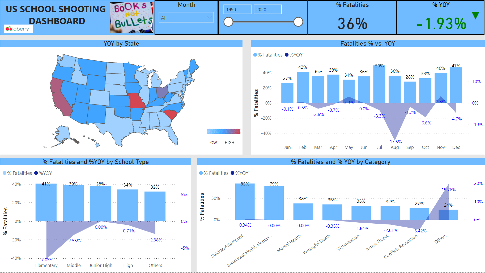

# US SCHOOL SHOOTING DASHBOARD

## Project Summary

School is an educational institution designed to provide learning spaces and learning environments for the teaching of students under the direction of teachers.

    Children, teenager and adults find themselves in these places because they are filled with the desire to learn in order to impact our world. Unfortunately, we have noticed that these places of learning are sometimes turning into fields of violence that destroy lives. School Shooting has become recurring events in America. Having a deeper idea of this situation will allow us to make practical arrangements to better understand them and save lives.

    With school shooting being a major issue in our nation, let’s in this Project analyze the Percentage Fatalities and Year over Year by Month, Category, School type and states in the United States from 1990 to 2020. This will enable a better approach in making decision on how to enhance school security system in US.

---

## Business Problem

Organizations need clear analytics outputs that transform raw project data into actionable insights for better decision-making.

---

## Objective

- Analyze datasets and build machine learning workflows to identify predictive patterns.
- Prepare and transform data for model training, evaluation, and forecasting tasks.
- Present AI and machine learning insights in a professional portfolio-ready format.

---

## Tools & Technologies

- Python
- Pandas
- Machine Learning
- Forecasting
- Data Analytics

---

## Project Workflow

- Prepared and cleaned the dataset for machine learning analysis.
- Explored data patterns and feature relationships.
- Built predictive or analytical models using Python-based workflows.
- Evaluated model performance and analytical outputs.
- Documented findings and business recommendations.

---

## Key Insights

- Used SQL queries to extract and analyze structured business data.
- Joined and transformed relational datasets to support reporting needs.
- Identified patterns from database records for business decision-making.
- Presented query-driven insights in a recruiter-friendly analytics format.

---

## Final Dashboard / Project Preview

---

## Business Impact

- Supports predictive analytics and data-driven forecasting workflows.
- Improves business visibility through AI-driven trend and pattern analysis.
- Demonstrates practical machine learning and predictive analytics skills.

---

## Portfolio Navigation

[← Back to Portfolio Home](../README.md)
